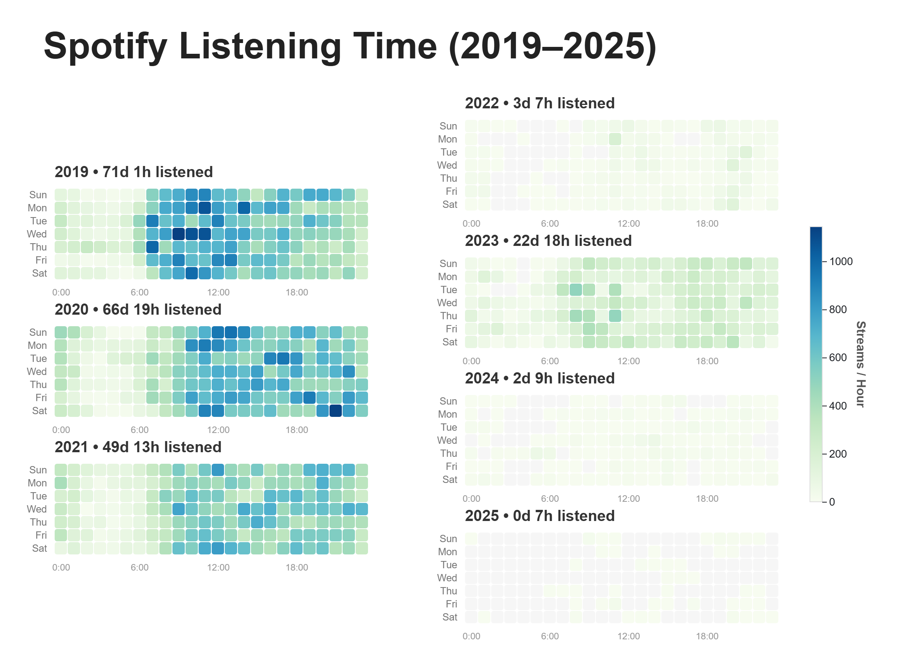
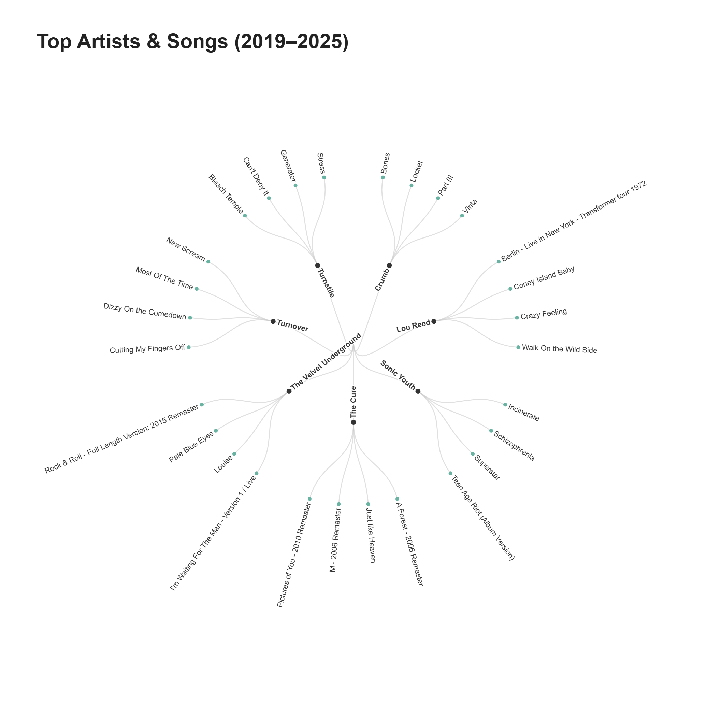

# Spotify Streaming History Visualization (2019–2025)

##  Project Overview
This project visualizes 7 years of personal Spotify streaming data (2019–2025) to identify long-term listening habits, top artists, and song preferences. The goal was to transform raw JSON logs into actionable insights using D3.js and JavaScript.

Notably, the visualization reveals a significant behavioral shift starting in mid-2021. The data captures the precise moment I migrated to Apple Music following their introduction of lossless audio, showing a quantifiable decline in Spotify engagement from 50+ days/year (2021) to under 15 days/year (2022).

##  Visualizations

### 1. Listening Habits Heatmap (2019–2025)
An analysis of listening frequency by hour of the day and day of the week, revealing patterns in daily routines.

### 2. Artist & Song Hierarchy (Radial Cluster)
A dendrogram clustering the Top 7 Artists and their Top 4 Songs, visualizing the "soundtrack" of the last 7 years.

##  Technologies Used
* **JavaScript (ES6+)**: Data manipulation and hierarchical processing.
* **D3.js (v7)**: Advanced SVG rendering, radial cluster layouts, and color scales.
* **Observable**: Used for rapid prototyping and interactive data exploration.
* **JSON**: Aggregation of 17+ separate streaming history files.

##  How It Works
1.  Data Ingestion: Aggregates 17 separate Spotify JSON history files into a single dataset.
2.  Cleaning:
     Parses timestamps into local JavaScript `Date` objects.
     Standardizes artist names (e.g., merging "The Velvet Underground" variations).
     Filters out messy metadata to ensure clean visualization labels.
3.  Hierarchy Construction: Transforms flat data into a `Root -> Artist -> Song` tree structure for the radial layout.
4.  Rendering: Uses D3 cluster layouts to generate the circular connections and scale-based coloring.

## Code Structure
The core visualization logic is organized in the `/code` folder:
 `data_loader.js`: Handles file parsing and date conversion.
 `data_hierarchy.js`: Logic for ranking artists and building the tree structure.
 `chart_radial.js`: D3 code for the circular artist cluster.
 `chart_heatmap.js`: D3 code for the timeline grid visualization.

## Future Improvements
 Add interactive tooltips on hover for specific stream counts.
 Integrate Spotify API to fetch album artwork for top tracks.

---
*Note: Raw JSON data files are excluded from this repository for privacy reasons.*